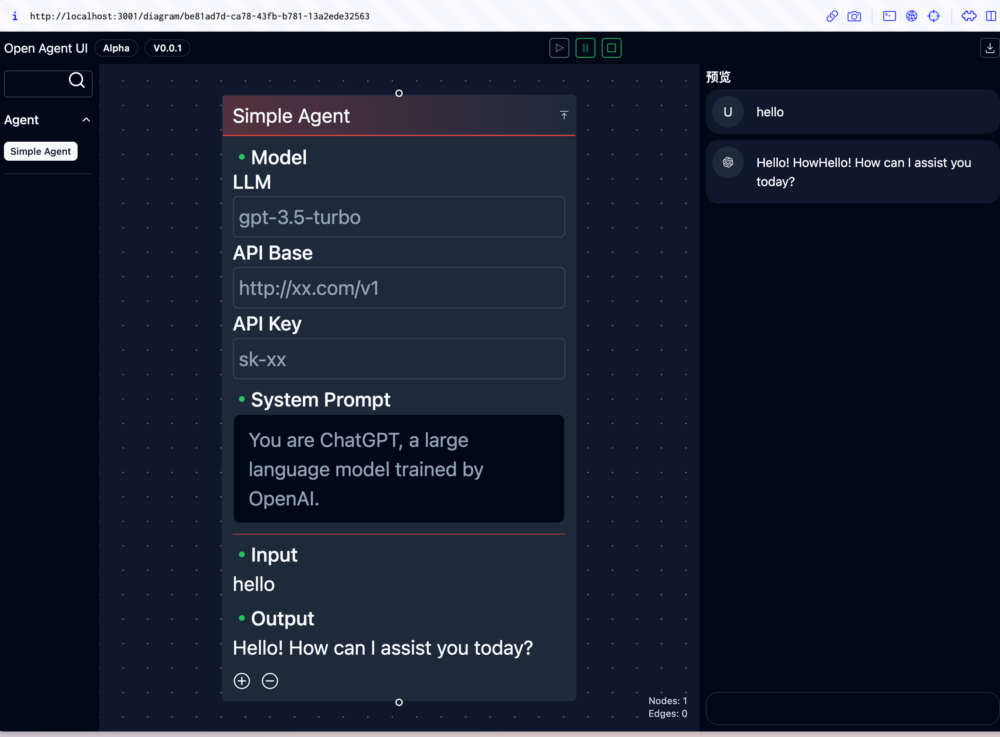

# GITS (Ghosts In The Shell): 前端驱动的多 Agent Workflow 框架

## Overview

## Features

- [x] 低代码
- [x] 可部署
- [x] 可调式

## Technique

### Flow Framework

经过各种选型，workflow 的 UI 框架已毫无悬念的确定为 `reactflow`。

- ✅ `reactflow`
- ❌ `flume`
- ❌ `reaflow`
- ❌ `react-flow-chart`

### Troubleshoots

## Todo

- [ ] :rocket: Thread

- [ ] 使用 layout 统一 `RootLayout` 和 `RunnerLayout`

- [ ] `prisma-json-types-generator` type reference
  - 目前使用 string union 可以有 IDE 提示，使用 Enum 则没
  - 目前不支持使用 `PrismaJson.xxx`，无论文件写成 `xx.ts` 还是 `xx.d.ts`

- [ ] fix `new nodeTypes`, ref: https://github.com/xyflow/xyflow/issues/3243

- [x] `@monaco-editor/react` 需要连上 clash 才可以装，不确定后续 docker 部署的时候会不会有问题。。
  - review: 没问题
